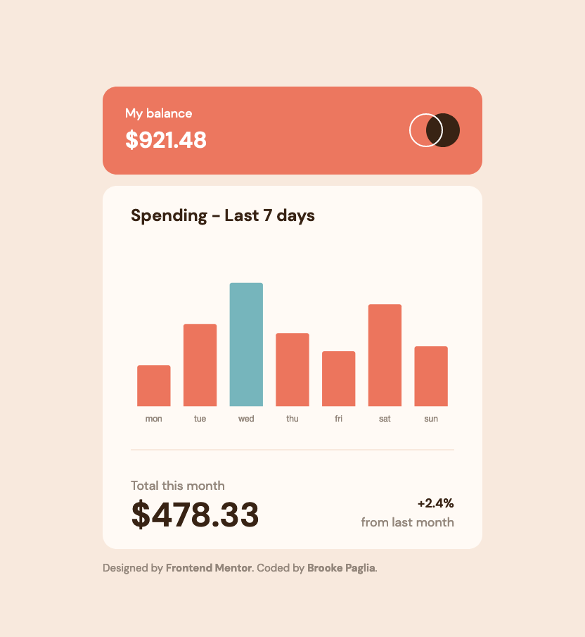

# Expenses Chart Component

A responsive, simple budget component. The component is built with a mobile-first process. The design for this component was provided by [Frontend Mentor](https://www.frontendmentor.io/challenges/expenses-chart-component-e7yJBUdjwt).

## User Story

Users should be able to:

- View the bar chart and hover over the individual bars to see the correct amounts for each day
- See the current day’s bar highlighted in a different colour to the other bars
- View the optimal layout for the content depending on their device’s screen size
- See hover states for all interactive elements on the page

## Screenshot

## Live Site

[Expenses Chart - Live Link](https://brookescodestuff.github.io/expenses-chart/)

## Built with

- Semantic HTML5 markup
- CSS custom properties
- Mobile-first workflow
- [Chart.js](https://chartjs.org/) - Javascript charting utility